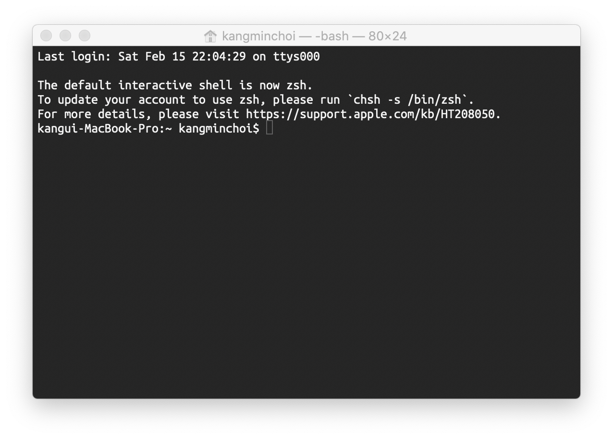

# 0장 쉘 스크립트 특강

쉘 스트립트(`Shell Scripts`)는 특정 쉘(이 문서의 경우 `Bash`)이 일련의 명령을 스크립트에 적힌 순서대로 실행하도록 하는 텍스트 파일이고, 쉘(`Shell`)은 운영 체제가 제공하는 명령들을 사용할 수 있도록 해주는 커맨드라인 인터페이스(`Command Line Interface`)이다.  

  

터미널을 이용해 시스템과 상호작용하는 것은 벅찬 일 같아 보일 수도 있다.  
하지만 시간이 흐름에 따라 그냥 터미널을 열어 간단한 시스템 변경을 수행하는 것이 메뉴를 따라 마우스를 움직여 바꾸려는 옵션을 찾는것 보다 자연스러워질 것이다.

`Bash`의 아름다움은 이식성이고, 이 문서의 많은 스크립트가 `그대로 동작`할 것이다.

### 명령 실행하기
`Bash`의 핵심 능력은 시스템에서 명령을 실행하는 것이다.  
간단한 "Hello World!" 예제를 실험해보자.  
`echo` 명령은 다음과 같이 텍스트를 화면에 표시한다
```bash
$ echo "Hello World"
```
bash가 이들 표준 명령을 찾는 디렉터리는 `PATH`라는 환경 변수에 저장돼 있다.  
echo를 `PATH`변수에 함께 사용해 그 내용을 볼 수 있다.  
```bash
$ echo $PATH
```
출력된 디렉터리들은 서로 콜론으로 나뉘어 있다.  
bash는 사용자가 프로그램이나 명령을 실행하려고 할 때 이들 디렉터리를 찾아본다.  
해당 명령이 디렉터리에 저장돼 있지 않으면, bash는 실행할 수 없다.  
또한 bash는 PATH에 적힌 순서대로 살펴본다.  
이 순서가 중요한데, 같은 이름의 두 명령이 PATH에 있는 두 디렉터리에 있을 때 순서에 따라 차이가 발생하기 때문이다.  
특정 명령을 찾는 데 문제가 있다면, `which`명령을 이용해 쉘이 PATH 중 어디에 있는지 확인할 수 있다.  
```bash
$ which ruby
$ which echo
```

```bash

```

```bash

```

```bash

```

```bash

```

```bash

```